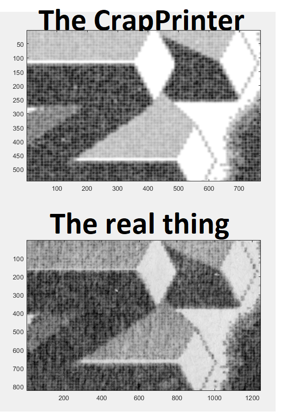
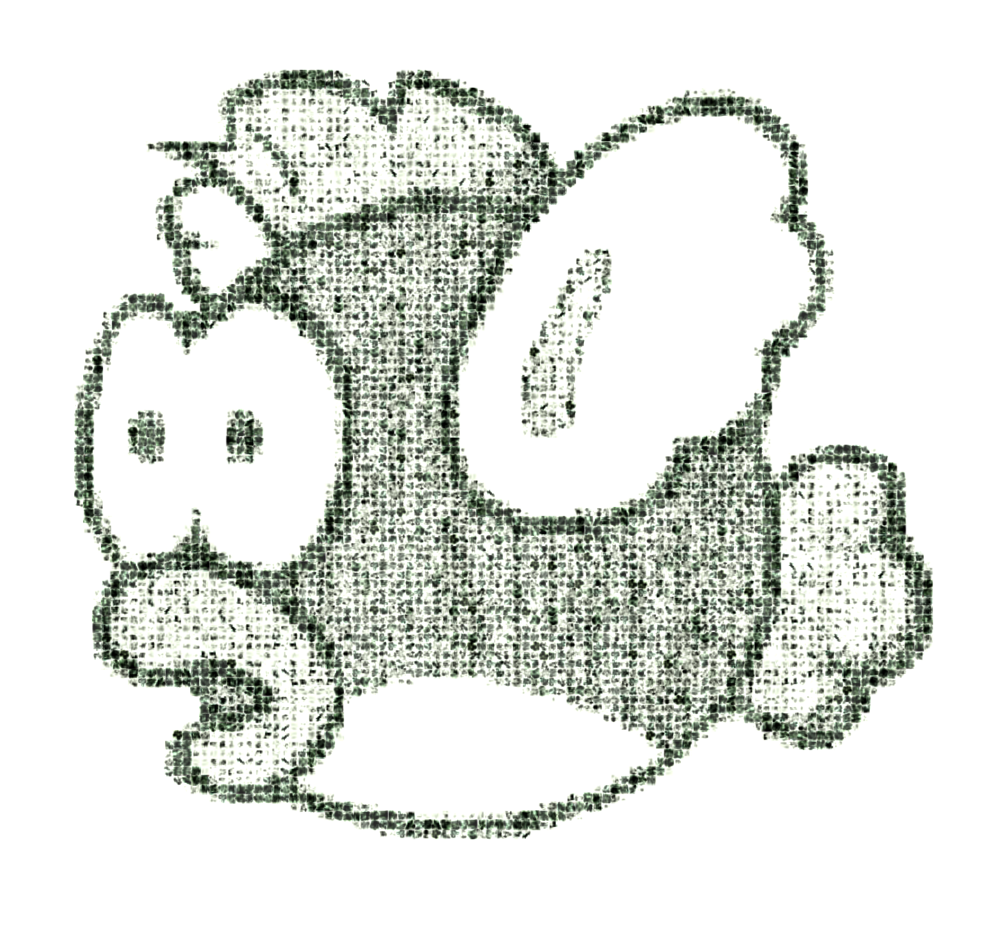

# Gameboy Printer Paper Simulation

* Creation Date: 2020-08-23, last update 2021-06-27
* Authors: *Raphaël BOICHOT, Brian Khuu*

This projects serves as output device for https://github.com/mofosyne/arduino-gameboy-printer-emulator

The purpose of this octave/matlab script is to do an accurate simulation of an output of a Game Boy Printer mimicking the effect of the thermal printer head on the Gameboy Printer roll. The project emerges after a discussion between *Raphaël BOICHOT*, *maxs - thatguywithagameboycamera*, *herr_zatacke (@herr_gack)*, *Björn (@gameboycameramaniac)*, *R.A.Helllord* and *crizzlycruz (@23kpixels)* in Gameboy Camera Club Discord.

Here is the idea : as Game Boy Printer paper rolls are more and more difficult to find and subjected to definitive deterioration with time, why not trying to find a way to output directly Game Boy Printer images in a digital format so that they become time insenstive. It should be possible to make an "after converter" that outputs images having the same soft aspect that printed paper, with the tone, noise, granularity and aliasing due to the printer head. 

My first idea was to do a simulation of printer head by some sort of Gaussian dots with lots of noise. I took inspiration from cashier tickets and Game Boy Printer scans at high resolution. The result was interesting but even by playing on noise... is was not the real thing.

# Early attemps to play with noisy gaussian dots

# It must be like the real thing !

After considering many comparisons between the code V1 and real prints obtained with a recently bought Pocket Printer, I was still not satisfied by the result. The difficulty is that the printer adds noise to the image at different length scales due to paper grain.  It was particularly difficult to render this with a code. So my new idea was to sample a collection of representative pixels of the different grayscales on a good quality scan of isolated pixels printed with my printer.

Typically, there is no image available to print in Game Boy library that presents perfectly isolated pixels. My idea was to create a test case with my brand new SD Game Boy printer code :

https://github.com/Raphael-Boichot/The-Arduino-SD-Game-Boy-Printer

So I created this test image with isolated pixels of the three different grayscales (white is just ignored) :

Then I scanned a printing of this image at 3600 dpi (sufficient to see the details of pixels, each pixel beeing approx. 20x20 pixels on the scan) :

And I sampled manually a collection of 50 pixels of each level of grayscale (very boring task but quite rewarding at the end) : 

Then the Octave code just reads a pixel on a pixel perfect image to get its color, picks a random pixel among the 50 of its own "color" and draws it on a new file with some overlapping. 50 pixels of each color is not much, but a pixel is a simple matrix of value. In consequence, to increase randomness each pixel itself is flipped or rotated randomly so that more than 200 different pixels can be generated out of just 50 for each color. Finally, the real printing paper presents fibres that create vertical streaks of "ink" (thermal paper has no ink but you see the idea). So the code randomly decreases the intensity of printing along some streaks of limited length chosen randomly. Of course the code in its present form can be improved, but the result is enough for my poor visual acuity.

I choose to make a test case with a Chip Chip printed from Super Mario Deluxe :
# The pixel perfect test case :

I then scanned this printing at 3600 dpi (after some contrast enhancement, the printings appear in fact greenish)
# A scan of printed image on a real Game Boy Printer :

Then I ran Octave with the pixel perfect image and here the result : 
# The e-paper image obtained with Octave :

# How to use the Game Boy Printer paper emulation ?

- Copy paste game boy serial data obtained from https://github.com/mofosyne/arduino-gameboy-printer-emulator into Entry_file.txt
- Open Octave/Matlab code "Main_Decoder.m"
- Choose some options (default are OK)
- Run and wait
- Enjoy your images

The Game Boy Printer paper emulator is regularly updated to follow it's companion project, the Game Boy Printer emulator, in terms of compatibility.

# The complete list of games compatible with the Game Boy Printer

- *1942 (never released in Japan)*
- *Alice in Wonderland (never released in Japan)*
- *Animal Breeder 3 (あにまるぶりーだー3)*
- *Animal Breeder 4 (あにまるぶり〜だ〜4)*
- *Aqualife (アクアライフ)*
- *Asteroids (never released in Japan)*
- *Austin Powers: Oh, Behave! (never released in Japan)*
- *Austin Powers: Welcome to My Underground Lair! (never released in Japan)*
- *Cardcaptor Sakura: Itsumo Sakura-chan to Issho! (カードキャプターさくら 〜いつもさくらちゃんと一緒〜)*
- *Cardcaptor Sakura: Tomoe Shōgakkō Daiundōkai (カードキャプターさくら 〜友枝小学校大運動会〜)*
- *Chee-Chai Alien (ちっちゃいエイリアン)*
- *Cross Hunter - Monster Hunter Version (クロスハンター モンスター・ハンター・バージョン)*
- *Cross Hunter - Treasure Hunter (クロスハンター トレジャー・ハンター・バージョン)*
- *Cross Hunter - X Hunter Version (クロスハンター エックス・ハンター・バージョン)*
- *Daa! Daa! Daa! - Totsuzen Card de Battle de Uranai de! (だぁ!だぁ!だぁ! とつぜん★カードでバトルで占いで!?)*
- *Daikaijuu Monogatari: The Miracle of the Zone II (大貝獣物語 ザ・ミラクル オブ ザ・ゾーンII)*
- *Dejiko no Mahjong Party (でじこの麻雀パーティー)*
- *Densha de GO! 2 (電車でGO!2)*
- *Dino Breeder 3 - Gaia Fukkatsu (ディノブリーダー3 〜ガイア復活〜)*
- *Disney's Dinosaur (never released in Japan)*
- *Disney's Tarzan (ディズニーズ ターザン)*
- *Donkey Kong Country (ドンキーコング2001)*
- *Doraemon Kart 2 (ドラえもんカート2)*
- *Doraemon Memories - Nobita no Omoide Daibouken (ドラえもんメモリーズ のび太の想い出大冒険)*
- *Doraemon no Quiz Boy (ドラえもんのクイズボーイ)*
- *E.T.: Digital Companion (never released in Japan)*
- *Fairy Kitty no Kaiun Jiten: Yousei no Kuni no Uranai Shugyou (フェアリーキティの開運辞典 妖精の国の占い修行)*
- *Fisher-Price Rescue Heroes: Fire Frenzy (never released in Japan)*
- *Game Boy Camera (ポケットカメラ)*
- *Golf Ou: The King of Golf (ゴルフ王)*
- *Hamster Club (ハムスター倶楽部)*
- *Hamster Paradise (ハムスターパラダイス)*
- *Hamster Paradise 2 (ハムスターパラダイス2)*
- *Harvest Moon 2 (牧場物語GB2)*
- *Hello Kitty no Beads Koubou (ハローキティのビーズ工房)*
- *Hello Kitty no magical museum (ハローキティのマジカルミュージアム)*
- *Hello Kitty Pocket Camera (Japan, unreleased)*
- *Jinsei Game Tomodachi takusan Tsukurou Yo! (人生ゲーム 友達たくさんつくろうよ!)*
- *Kakurenbo Battle Monster Tactics (モンスタータクティクス)*
- *Kanji Boy (漢字BOY)*
- *Karamuchou wa Oosawagi!: Porinkiis to Okashina Nakamatachi (カラムー町は大さわぎ! 〜ポリンキーズとおかしな仲間たち〜)*
- *Kaseki Sousei Reborn II: Monster Digger (化石創世リボーン2 〜モンスターティガー〜)*
- *Kidou Senkan Nadesico - Ruri Ruri Mahjong (機動戦艦ナデシコ ルリルリ麻雀)*
- *Kisekae Monogatari (きせかえ物語)*
- *Klax (never released in Japan)*
- *Little Nicky (never released in Japan)*
- *Logical (never released in Japan)*
- *Love Hina Pocket (ラブ ひな)*
- *Magical Drop (never released in Japan)*
- *Mary-Kate and Ashley Pocket Planner (never released in Japan)*
- *McDonald's Monogatari : Honobono Tenchou Ikusei Game (マクドナルド物語)*
- *Mickey's Racing Adventure (never released in Japan)*
- *Mickey's Speedway USA (never released in Japan)*
- *Mission: Impossible (never released in Japan)*
- *Monster ★ Race 2 (もんすたあ★レース2)*
- *Monster ★ Race Okawari (もんすたあ★レース おかわり)*
- *Nakayoshi Cooking Series 1 - Oishii Cake-ya-san (なかよしクッキングシリーズ1 おいしいケーキ屋さん)*
- *Nakayoshi Cooking Series 2 - Oishii Panya-san (なかよしクッキングシリーズ2 おいしいパン屋さん)*
- *Nakayoshi Cooking Series 3 - Tanoshii Obentou (なかよしクッキングシリーズ3 たのしいお弁当)*
- *Nakayoshi Cooking Series 4 - Tanoshii Dessert (なかよしクッキングシリーズ4 たのしいデザート)*
- *Nakayoshi Cooking Series 5 - Cake Wo Tsukurou (なかよしクッキングシリーズ5 こむぎちゃんのケーキをつくろう!)*
- *Nakayoshi Pet Series 1: Kawaii Hamster (なかよしペットシリーズ1 かわいいハムスター)*
- *Nakayoshi Pet Series 2: Kawaii Usagi (なかよしペットシリーズ2 かわいいウサギ)*
- *Nakayoshi Pet Series 3: Kawaii koinu (なかよしペットシリーズ3 かわいい仔犬)*
- *NFL Blitz (never released in Japan)*
- *Nintama Rantarou GB: Eawase Challenge Puzzle (忍たま乱太郎GB えあわせチャレンジパズル)*
- *Ojarumaru: Mitsunegai Jinja no Ennichi de Ojaru! (おじゃる丸 〜満願神社は縁日でおじゃる!〜)*
- *Pachinko Data Card - Chou Ataru-kun (Pachinko Data Card ちょ〜あたる君)*
- *Perfect Dark (never released in Japan)*
- *Pocket Family 2 (ポケットファミリーGB2)*
- *Pocket Puyo Puyo-n (ぽけっとぷよぷよ〜ん)*
- *Pokémon Card GB2: Great Rocket-Dan Sanjō! (ポケモンカードGB2 GR団参上!)*
- *Pokémon Crystal (ポケットモンスター クリスタルバージョン)*
- *Pokémon Gold (ポケットモンスター 金)*
- *Pokémon Picross (Japan, unreleased)*
- *Pokémon Pinball (ポケモンピンボール)*
- *Pokémon Silver (ポケットモンスター 銀)*
- *Pokémon Trading Card Game (ポケモンカードGB)*
- *Pokémon Yellow: Special Pikachu Edition (ポケットモンスター ピカチュウ)*
- *Purikura Pocket 3 - Talent Debut Daisakusen (プリクラポケット3 〜タレントデビュー大作戦〜)*
- *Puzzled (never released in Japan)*
- *Quest for Camelot (never released in Japan)*
- *Roadsters Trophy (never released in Japan)*
- *Sanrio Timenet: Kako Hen (サンリオタイムネット 過去編)*
- *Sanrio Timenet: Mirai Hen (サンリオタイムネット 未来編)*
- *Shinseiki Evangelion Mahjong Hokan Keikaku (新世紀エヴァンゲリオン 麻雀補完計画)*
- *Sōko-ban Densetsu: Hikari to Yami no Kuni (倉庫番伝説 光と闇の国)*
- *Super Black Bass Pocket 3 (スーパーブラックバスポケット3)*
- *Super Mario Bros. Deluxe (スーパーマリオブラザーズデラックス)*
- *Sweet Angel (スウィートアンジェ)*
- *Sylvanian Families 3 - Hoshi Furu Yoru no Sunadokei (シルバニアファミリー３　星ふる夜のすなどけい)*
- *Sylvanian Families: Otogi no Kuni no Pendant (シルバニアファミリー 〜おとぎの国のペンダント〜)*
- *Tales of Phantasia: Nakiri's Dungeon (テイルズ オブ ファンタジア なりきりダンジョン)*
- *The Legend of Zelda: Link's Awakening DX (ゼルダの伝説 夢をみる島DX)*
- *The Little Mermaid 2: Pinball Frenzy (never released in Japan)*
- *Tony Hawk's Pro Skater 2 (never released in Japan)*
- *Trade & Battle: Card Hero (トレード&バトル カードヒーロー)*
- *Tsuri Sensei 2 (釣り先生2)*

--------------------------------------------------------------------------------
# Telegram Gameboy Camera Chatroom

Got telegram instant messaging and have some questions or need any advice, or just want to share? Invite link below:
https://t.me/gameboycamera

--------------------------------------------------------------------------------

# Some known relaxing scene made with the code to end :

