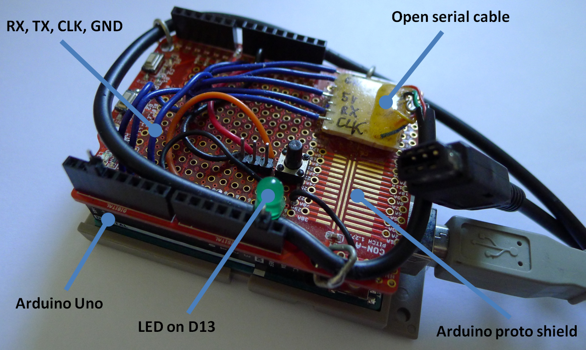
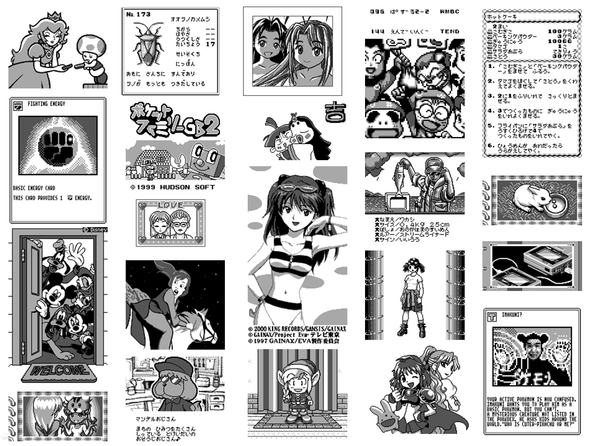

# Gameboy Printer Paper Simulation

* Creation Date: 2020-08-23, last update 2021-09-02
* Authors: *Raphaël BOICHOT, Brian KHUU*
* Featured on [Hackaday](https://hackaday.com/2021/06/25/simulating-the-game-boy-printers-actual-paper-output/) and companion project from the [NeoGB Printer](https://github.com/zenaro147/NeoGB-Printer), the [Arduino SD Game Boy Printer](https://github.com/Raphael-Boichot/The-Arduino-SD-Game-Boy-Printer) and the [GameBEye](https://github.com/mtouzot/GameBEye).

This project originates from the [Arduino Game Boy Printer Emulator](https://github.com/mofosyne/arduino-gameboy-printer-emulator) and has still 100% compatibility with it.

Author want to thanks Frédéric Mercier for the find of the original Huc-3 mapper **Pocket Family 2** cartridge in Japan.

The purpose of this Arduino/GNU Octave/Matlab project is to output images from a Game Boy Printer emulator with the same soft aspect than images printed on a fresh roll of thermal paper into a Game Boy Printer. The project comes with a fork of the game boy printer emulator that allows to print with any of the **110 games compatible with the Game Boy Printer**. Compression and custom palettes are supported by the decoder. The project also proposes for the first time the probable **complete list of games compatible with the Game Boy Printer with printing examples from every known game and 100% or any% saves for most of them.**

The project emerges after a discussion between *Raphaël BOICHOT*, *mofosyne*, *maxs - thatguywithagameboycamera*, *herr_zatacke (@herr_gack)*, *Björn (@gameboycameramaniac)*, *R.A.Helllord* and *crizzlycruz (@23kpixels)* on the Gameboy Camera Club Discord. The motivation ? As Game Boy Printer paper is becoming difficult to find and subjected to definitive deterioration with time, emulating it is more and more appealing from an heritage conservation point of view. And using 6 AA batteries in 2021, honestly...

Fresh thermal paper used in this study was graciously sent to me by *R.A.Helllord* from the Game Boy Camera Club Discord. 

The Game Boy printer emulator developped by Brian Khuu which is used here is able to capture a stream of serial data under text form. The project here aims to tranform this hexadecimal text stream into pleasant images that have the realistic aspect of a roll of paper exiting a thermal printer. Reproducing the tone, noise, granularity and aliasing of to the printer head is challenging compared to a classical pixel perfect rendering. And what is challenging is fun.

My first idea was to do a simulation of printer head by replacing hard square pixels by some sort of bell-shaped spots with lots of noise. A 2D bell-shaped approximation had a sense to me as injecting heat in a point on a 2D surface result in gaussian distribution of temperatures. On thermal paper, tones are due to a chemical reaction of a powder deposited on the surface of paper driven by temperature and phase change. I took inspiration from cashier tickets and Game Boy Printer scans at high resolution. Misalignment of the printer head was also simulated. The result of a pure mathematical approach was interesting for sure.

# Let's play with noisy gaussian dots

# The pixel perfect test case :

# Example of an early attempt of paper simulation

Even if was not bad at all, pixels were too regularly spaced and paper fibers that deform the dots and create vertical streaks on paper were impossible to simulate with this  approach. We need a more agressive design !

# It MUST be like the real thermal paper !

After considering the differences between early outputs and real prints (scanned at 3600 dpi) obtained with a recently bought Pocket Printer, I was still not satisfied by the result. The difficulty is that the printer head and paper grain add noise to the image at different length scales. Moreover, the needles from thermal printer head do not just create noisy gaussian dots. These dots also have a random shape (typically due to fibers in paper). So my new idea was to sample a collection of representative pixels of the different grayscales on a good quality scan of isolated pixels printed with my Game Boy Printer. 

There is no image available to print in Game Boy library that presents perfectly isolated pixels in huge quantity. So I have created a test case with my brand new SD Game Boy printer code https://github.com/Raphael-Boichot/The-Arduino-SD-Game-Boy-Printer

I first printed this test image with isolated pixels of the three different grayscales (white is just ignored):

Then I scanned a printing of this image at 3600 dpi (sufficient to see the details of pixels, each pixel beeing approx. 20x20 pixels on the scan):

And I sampled manually a collection of 50 pixels of each level of grayscale (very boring task but quite rewarding at the end): 

Then the GNU Octave/Matlab code just reads a pixel on a pixel perfect image to get its color, picks a random pixel among the 50 of its own "color" and draws it on a new file with some overlapping. 50 pixels of each color is not much, but a pixel is a simple matrix of value. In consequence, to increase randomness each pixel itself is flipped or rotated randomly so that more than 200 different pixels can be generated out of just 50 for each color. Finally, the real printing paper presents fibres that create vertical streaks of "ink" (thermal paper has no ink but you see the idea). So the code randomly decreases the intensity of printing along some streaks of limited length chosen randomly. Of course the code in its present form can be improved, but the result is enough for my poor visual acuity.

I choose to make a test case with a Chip Chip printed from Super Mario Deluxe:
# The pixel perfect test case:

I then scanned this printing at 3600 dpi (after some contrast enhancement, the printings appear in fact greenish)
# A scan of printed image on a real Game Boy Printer:

Then I ran GNU Octave/Matlab with the pixel perfect image and here the result: 
# The e-paper image obtained with Octave:

# Final output of the decoder (what you will get) with correct ratio image/paper, blue paper hue (example) and random borders:

# Which Game Boy Printer emulator using with the Matlab/Octave decoder ?

The Octave/Matlab decoder is of course natively backward compatible with https://github.com/mofosyne/arduino-gameboy-printer-emulator. However, I've added some new features to the original Game Boy Printer emulator after fruitful discussions with Rafael Zenaro from the Game boy Camera Club :

- *The game compatibility have been increased to 100% by applying two simple rules to the error packets sent by the Printer emulator to games: the error packet is always 0x00 before printing (the games clearly do not mind this error byte most of the time) except when an empty data packet is received, where it becomes 0x04 (image data full). This allows triggering the print command for certain rare games that require this. The post-printing commands are still the ones from the original project, except some increase of the number of busy state commands.*

- *Assembling automatically the images is challenging with some games so a modification of both the emulator and the decoder is proposed to ensure proper printing for a dozen of "difficult" games. This will be called "TimeOut" mode in opposition to the default "margin" mode using post-printing margins information to separate images*

The pinout have been slightly modified. The SOUT pin have been moved to D5 to allow direct pin compatibility with this other project: https://github.com/Raphael-Boichot/The-Arduino-SD-Game-Boy-Printer. It is recommanded to add a LED on pin D13 to allow the Arduino to indicate flashing of the board and packet transmission.

# How to use the Game Boy Printer paper emulation ?

You will need: the cheapest Arduino Uno, the cheapest LED, the cheapest wires, the cheapest soldering iron or the cheapest breadboard, a serial cable to sacrify (for example the cheapest chinese clone found on Aliexpress, please do not sacrify original Nintendo cables) and for ease the cheapest multimeter with continuity mode. The total project cost should be around $10 maximum. Wire and/or solder all that stuff, recharge your cheapest NiMH batteries and you are ready for printing.

- Install the last Arduino IDE (https://www.arduino.cc/en/software) and load the .ino file to the board.
- Install the open-source GNU Octave (https://www.gnu.org/software/octave/index) or enjoy your pricey Matlab license.
- Connect your Game Boy to Arduino with serial cable, open the serial console in 115200 bauds and print as with a real Game Boy Printer.
- Copy paste text obtained from the Arduino serial output into Entry_file.txt
- Open Octave/Matlab code "Main_Decoder.m"
- Choose some color palettes and printing options (default are OK).
- Run and wait for completion, code is fast on Matlab, slower with Octave.
- Enjoy your images. The code outputs both pixel perfect and paperlike images, can handle compressed protocol, custom palettes and the many variations of the Game Boy printing protocol. The Entry_file.txt is automatically backed-up with a unique date/ID so that you can process old printing sessions later or with other tools, for example https://github.com/HerrZatacke/wifi-gbp-emulator

Now let's detail the new features available with this version of emulator:

**Automatic mode or printing with margins**

Set gbp_serial_io.cpp and Main_Decoder.m like this:

    #define GBP_PKT10_TIMEOUT_MS 400 in gbp_serial_io.cpp line 39
    Timeout_printing=0;  in Main_Decoder.m line 13
    
This is the mode by default: with this settings images will be separated by the decoder if an after margin different than zero is detected. Most of the games are happy with that and in particular the Game Boy Camera. For 99% of the users this mode will be enough, no need to go farther.

**Idle mode or printing with Timeout message**

Set gbp_serial_io.cpp and Main_Decoder.m like this:

    #define GBP_PKT10_TIMEOUT_MS 15000 in gbp_serial_io.cpp line 39
    Timeout_printing=1;  in Main_Decoder.m line 13

In idle mode, the printing command from the Game Boy is not taken into account. Instead, you have to wait for the "TimeOut" message to appear into the Arduino serial (which means that the serial is idle) before making another print. This allows the decoder to know how to assemble images that contains inner margins. Remind that the real printer uses a roll of paper that you decide to cut manually, so certains games do not care of the printing margins. So you have to force a bit the image separation in order to get the nice printing wanted by the programmers.

Games that can take advantage from the "TimeOut" or idle mode are (for example): 
- *Nakayoshi Cooking (3, 4 and 5), Mc Donald's Monogatari, Hello Kitty no Magical museum and Nintama Rantarou GB: Eawase Challenge Puzzle. They generate splitted image files in Automatic mode due to weird printing protocol with very long lag times in-between chunks of images and/or inner margins.*
- *Mary-Kate and Ashley Pocket Planner and E.T.: Digital Companion have the exact inverse problem : they always print images with no margin by default. Using TimeOut image splitting is mandatory.*
- *In general, each time you used the Automatic mode, if the images decoded are splitted, stuck together or in brief, not what you expect in terms of assembly, use idle mode with TimeOut separator to print.*

**Direct printing from Matlab/GNU Octave without using the Arduino IDE !**

You can run "Read_directly_from_Arduino_Matlab.m" or "Read_directly_from_Arduino_Octave.m" directly to acquire data and decode them in the same run. It behaves like the Arduino Serial output from the IDE but without the need to copy-paste text output: the decoder is ran automatically as soon as you reboot the Arduino after a printing session. How to use it : 

- Install the last Arduino IDE (https://www.arduino.cc/en/software) and compile/load the .ino file with the TimeOut parameter you need. Note the USB port number, close the IDE, you won't need it.
- Use your pricey Matlab license or the free GNU Octave alternative and modify the script with the correct port number and run it.
- Connect your Game Boy to Arduino with serial cable and print. It must behave like with the Arduino serial console but into the GNU Octave/Matlab Command window.
- Print your images as usual.
- Once the printing session is finished, reboot the Arduino, it will indicate to GNU Octave/Matlab that transmission is over and will run the decoder automatically.
- Enjoy your images. The code outputs both pixel perfect and paperlike images, can handle compressed protocol, custom palettes and the many variations of the Game Boy printing protocol.
- Code generates an output .txt file that you can process again later with the classical decoder "Main_Decoder.m" or with https://github.com/HerrZatacke/wifi-gbp-emulator. The text output is also automatically backed-up with a unique ID so that you would never lost your prints.

**Mobile printing !**

With an OTG cable, you can plug, power and control the Arduino directly from your mobile Android phone with Arduinodroid App. Simply copy the output from serial console, paste to Entry_file.txt and decode the images with Matlab Mobile (The App is free with limited cloud storage for unlicensed user, but enough for our case). Matlab Mobile is however not yet able to control directly the Arduino (contrary to PC), perhaps in a future release.

**Can I modify the palettes of the pixel perfect images or e-paper outputs ?**

The code is of course fully open to modifications. Edit "color_packet.m" and add a new line indicating your desired RGB triplets:

    colors=[255 255 255 168 168 168 84 84 84 0 0 0;% 1 = Black and white
            215 247 215 130 222 73 6 75 145 0 19 26;% 2 = Game Boy Color
            123 130 16 90 121 66 57 89 74 41 65 57;% 3 = Game Boy DMG
            255 255 255 89 255 252 239 42 248 0 0 0;% 4 = CGA
            255 255 255 255 128 128 128 64 64 0 0 0];% 5 = Salmon
 (R G B for white) (R G B for light gray) (R G B for dark gray) (R G B for black)];%Your palette
            
Then just edit "color_packet.m" to seek to the new palette by its line number in "color_packet.m"
        
    color_option=X; %X your custom palette

Same for the paper output, edit "epaper_packet.m" and seek for these commands: 

    if (paper_color==X)
    speckle_image(:,:,1)=speckle_image(:,:,1)*(R/255);
    speckle_image(:,:,2)=speckle_image(:,:,2)*(G/255);
    speckle_image(:,:,3)=speckle_image(:,:,3)*(B/255);
    end
    
X is the number of the e-paper palette and RGB the color levels applied to the whole image. Then just edit "color_packet.m" to seek to the new palette by its number in "Main_decoder.m"

    paper_color=X; %X your custome palette

# Examples of default palette output from the code:

White, blue and yellow papers have the regular tones of official Nintendo papers. Pink is an invented tone that would have been cool in the series.

**Known minor issues related to the printer emulator, Arduino side**

- *Printing with Hamster Club may crash after a certain number of images due to spamming of the serial console with 0F command in double speed mode. Apart from that, printing with this game is rather stable.*
- *Game Boy Camera have an escape command during packet transmission (push B to avoid cringe images to be printed in front of your parents). This command, which have no interest with an emulator, is not supported.*

**Known minor issues related to the decoder, Matlab/GNU Octave side**

- *Direct printing from Matlab/GNU Octave without using the Arduino IDE may crash if the Game Boy reboots into the printing session. The best is to reboot Arduino before the Game Boy to flush decoder text output between each games. Printing with the copy-paste method from the Arduino IDE is totally stable but requires more steps.*
- *The graphical objects (figures) from GNU Octave are very slow to display contrary to Matlab (codes being the sames).*
- *Finally, the way he serial port is handled under Matlab and GNU Octave is not the same, so I had to split the direct printing codes in two versions. All others codes are exactly the sames. I hope the two versions will be merged in a future release.*
- *The direct printing mode is not yet compatible with Matlab Mobile or GNU Octave for Android which is still a prototype. So the only mobile solution is to chain a mobile USB/Serial sniffer App with Matlab Mobile. This is not as elegant as a single code, single App solution, but it works.*

# The complete list of games compatible with the Game Boy Printer and the Printer Emulator (ポケットプリンタ - 対応ソフト)

There is in total 110 games compatible with the Game Boy Printer (and printer emulator). I've tested them on various machines (original GB, GBC, GBA and the Chinese GB Boy Colour clone, serial plugged to the Arduino to print) and can certify the printer support with printer emulator, even if some printing features are very tricky to reach ! I used a general purpose flash cartridge (EZ-FLASH Junior) for testing the games I do not own. Some rare games require the original cartridge (one game uses the uncommon HuC-3 mapper) or another flash cartridge for no obvious reasons (two games with common mappers are only compatible with the GB SMART 32M). One "game" (SMARTCOM) required a deep rom hack to counterpass a boot sequence trick and allow printing with real hardware. Timing to assess single or double speed mode in protocol was recorded with an analog oscilloscope probing the clock pin. 

The .zip file in the repo contains 100% or any% saves ready to use with printer features unlocked for most of the games, as well as examples of printer emulator output and prints for each of them. See the "Game Boy Printer Emulator - Games Support.xlsx" to check the various hints to print from these games, obscure Japanese and totally WTF ones included. This complete list was established by cross-checking English and Japanese game titles known for using the printer and by rom code analysis to reveal some new ones that were never included in any list before. This list was never published online before june 2021 and contains probably the entire game collection that uses the printer. 

The projet https://github.com/zenaro147/NeoGB-Printer uses the same engine and have exactly the same compatibility with games. It even adds some serial protocol analysis to automate automatic/timeout modes.

So, here the game list:

- *1942 (never released in Japan)*
- *Alice in Wonderland (never released in Japan)*
- *Animal Breeder 3 (あにまるぶりーだー3)*
- *Animal Breeder 4 (あにまるぶり〜だ〜4)*
- *Aqualife (アクアライフ)*
- *Asteroids (never released in Japan)*
- *Austin Powers: Oh, Behave! (never released in Japan)*
- *Austin Powers: Welcome to My Underground Lair! (never released in Japan)*
- *Austin Power Episode 3 - Yeah Baby Yeah (unreleased, rom CGBBA3P0.3)*
- *Austin Power Episode 4 - Why Make Millions (unreleased, rom CGBBA4P0.0)*
- *Cardcaptor Sakura: Itsumo Sakura-chan to Issho! (カードキャプターさくら 〜いつもさくらちゃんと一緒〜)*
- *Cardcaptor Sakura: Tomoe Shōgakkō Daiundōkai (カードキャプターさくら 〜友枝小学校大運動会〜)*
- *Chee-Chai Alien (ちっちゃいエイリアン)*
- *Cross Hunter - Monster Hunter Version (クロスハンター モンスター・ハンター・バージョン)*
- *Cross Hunter - Treasure Hunter (クロスハンター トレジャー・ハンター・バージョン)*
- *Cross Hunter - X Hunter Version (クロスハンター エックス・ハンター・バージョン)*
- *Daa! Daa! Daa! Totsuzen ★ Card de Battle de Uranai de!? (だぁ!だぁ!だぁ! とつぜん★カードでバトルで占いで!?)*
- *Daikaijuu Monogatari: The Miracle of the Zone II (大貝獣物語 ザ・ミラクル オブ ザ・ゾーンII)*
- *Dejiko no Mahjong Party (でじこの麻雀パーティー)*
- *Densha de GO! 2 (電車でGO!2)*
- *Dino Breeder 3 - Gaia Fukkatsu (ディノブリーダー3 〜ガイア復活〜)*
- *Disney's Dinosaur (never released in Japan)*
- *Disney's Tarzan (ディズニーズ ターザン)*
- *Donkey Kong Country (ドンキーコング2001)*
- *Doraemon Kart 2 (ドラえもんカート2)*
- *Doraemon Memories - Nobita no Omoide Daibouken (ドラえもんメモリーズ のび太の想い出大冒険)*
- *Doraemon no Game Boy de Asobouyo Deluxe 10 (ドラえもんのGBであそぼうよ デラックス10)*
- *Doraemon no Quiz Boy (ドラえもんのクイズボーイ)*
- *Dungeon Savior (ダンジョンセイバー)*
- *E.T.: Digital Companion (never released in Japan)*
- *Fairy Kitty no Kaiun Jiten: Yousei no Kuni no Uranai Shugyou (フェアリーキティの開運辞典 妖精の国の占い修行)*
- *Fisher-Price Rescue Heroes: Fire Frenzy (never released in Japan)*
- *Game Boy Camera or Pocket Camera (ポケットカメラ)*
- *Golf Ou: The King of Golf (ゴルフ王)*
- *Hamster Club (ハムスター倶楽部)*
- *Hamster Paradise (ハムスターパラダイス)*
- *Hamster Paradise 2 (ハムスターパラダイス2)*
- *Harvest Moon 2 (牧場物語GB2)*
- *Hello Kitty no Beads Koubou (ハローキティのビーズ工房)*
- *Hello Kitty no Magical Museum (ハローキティのマジカルミュージアム)*
- *Hello Kitty Pocket Camera (ハローキティのポケットカメラ, unreleased, rom GBDHKAJ0.2)*
- *Jinsei Game Tomodachi takusan Tsukurou Yo! (人生ゲーム 友達たくさんつくろうよ!)*
- *Kakurenbo Battle Monster Tactics (モンスタータクティクス)*
- *Kanji Boy (漢字BOY)*
- *Karamuchou wa Oosawagi!: Porinkiis to Okashina Nakamatachi (カラムー町は大さわぎ! 〜ポリンキーズとおかしな仲間たち〜)*
- *Karamuchou wa Oosawagi!: Okawari! (カラムー町は大さわぎ！おかわりっ！)*
- *Kaseki Sousei Reborn II: Monster Digger (化石創世リボーン2 〜モンスターティガー〜)*
- *Kettou Transformers Beast Wars - Beast Senshi Saikyou Ketteisen (決闘トランスフォーマービーストウォーズ ビースト戦士最強決定戦)*
- *Kidou Senkan Nadesico - Ruri Ruri Mahjong (機動戦艦ナデシコ ルリルリ麻雀)*
- *Kisekae Monogatari (きせかえ物語)*
- *Klax (never released in Japan)*
- *Konchuu Hakase 2 (昆虫博士2)*
- *Little Nicky (never released in Japan)*
- *Logical (never released in Japan)*
- *Love Hina Pocket (ラブ ひな)*
- *Magical Drop (never released in Japan)*
- *Mary-Kate and Ashley Pocket Planner (never released in Japan)*
- *McDonald's Monogatari : Honobono Tenchou Ikusei Game (マクドナルド物語)*
- *Mickey's Racing Adventure (never released in Japan)*
- *Mickey's Speedway USA (never released in Japan)*
- *Mission: Impossible (never released in Japan)*
- *Monster ★ Race 2 (もんすたあ★レース2)*
- *Monster ★ Race Okawari (もんすたあ★レース おかわり)*
- *Nakayoshi Cooking Series 1 - Oishii Cake-ya-san (なかよしクッキングシリーズ1 おいしいケーキ屋さん)*
- *Nakayoshi Cooking Series 2 - Oishii Panya-san (なかよしクッキングシリーズ2 おいしいパン屋さん)*
- *Nakayoshi Cooking Series 3 - Tanoshii Obentou (なかよしクッキングシリーズ3 たのしいお弁当)*
- *Nakayoshi Cooking Series 4 - Tanoshii Dessert (なかよしクッキングシリーズ4 たのしいデザート)*
- *Nakayoshi Cooking Series 5 - Cake Wo Tsukurou (なかよしクッキングシリーズ5 こむぎちゃんのケーキをつくろう!)*
- *Nakayoshi Pet Series 1: Kawaii Hamster (なかよしペットシリーズ1 かわいいハムスタ)*
- *Nakayoshi Pet Series 2: Kawaii Usagi (なかよしペットシリーズ2 かわいいウサギ)*
- *Nakayoshi Pet Series 3: Kawaii koinu (なかよしペットシリーズ3 かわいい仔犬)*
- *NFL Blitz (never released in Japan)*
- *Nintama Rantarou GB: Eawase Challenge Puzzle (忍たま乱太郎GB えあわせチャレンジパズル)*
- *Ojarumaru: Mitsunegai Jinja no Ennichi de Ojaru! (おじゃる丸 〜満願神社は縁日でおじゃる!)*
- *Pachinko Data Card - Chou Ataru-kun (Pachinko Data Card ちょ〜あたる君〜)*
- *Perfect Dark (never released in Japan)*
- *Pocket Family 2 (ポケットファミリーGB2)*
- *Pocket Kanjirou (ポケット漢字郎)*
- *Pocket Puyo Puyo-n (ぽけっとぷよぷよ〜ん)*
- *Pokémon Card GB2: Great Rocket-Dan Sanjō! (ポケモンカードGB2 GR団参上!)*
- *Pokémon Crystal (ポケットモンスター クリスタルバージョン)*
- *Pokémon Gold (ポケットモンスター 金)*
- *Pokémon Picross (ポケモンピクロス, unreleased, rom DMGAKVJ0.1)*
- *Pokémon Pinball (ポケモンピンボール)*
- *Pokémon Silver (ポケットモンスター 銀)*
- *Pokémon Trading Card Game (ポケモンカードGB)*
- *Pokémon Yellow: Special Pikachu Edition (ポケットモンスター ピカチュウ)*
- *Pro Mahjong Tsuwamono GB (プロ麻雀兵 GB)*
- *Purikura Pocket 3 - Talent Debut Daisakusen (プリクラポケット3 〜タレントデビュー大作戦〜)*
- *Puzzled (never released in Japan)*
- *Quest for Camelot (never released in Japan)*
- *Roadsters Trophy (never released in Japan)*
- *Sanrio Timenet: Kako Hen (サンリオタイムネット 過去編)*
- *Sanrio Timenet: Mirai Hen (サンリオタイムネット 未来編)*
- *Shinseiki Evangelion Mahjong Hokan Keikaku (新世紀エヴァンゲリオン 麻雀補完計画)*
- *SMARTCOM (never released in Japan)*
- *Sōko-ban Densetsu: Hikari to Yami no Kuni (倉庫番伝説 光と闇の国)*
- *Super Black Bass Pocket 3 (スーパーブラックバスポケット3)*
- *Super Mario Bros. Deluxe (スーパーマリオブラザーズデラックス)*
- *Sweet Angel (スウィートアンジェ)*
- *Sylvanian Families: Otogi no Kuni no Pendant (シルバニアファミリー 〜おとぎの国のペンダント〜)*
- *Sylvanian Families 2 - Irozuku Mori no Fantasy (シルバニアファミリー2～色づく森のファンタジー)*
- *Sylvanian Families 3 - Hoshi Furu Yoru no Sunadokei (シルバニアファミリー３　星ふる夜のすなどけい)*
- *Tales of Phantasia: Nakiri's Dungeon (テイルズ オブ ファンタジア なりきりダンジョン)*
- *The Legend of Zelda: Link's Awakening DX (ゼルダの伝説 夢をみる島DX)*
- *The Little Mermaid 2: Pinball Frenzy (never released in Japan)*
- *Tony Hawk's Pro Skater 2 (never released in Japan)*
- *Trade & Battle: Card Hero (トレード&バトル カードヒーロー)*
- *Tsuri Sensei 2 (釣り先生2)*
- *VS Lemmings (VS.レミングス)*

Tips for printing with japanese games : search for these characters: プリンタ (Printer) or more rarely ポケットプリンタ (Pocket Printer) in games menu. This sometimes brings you only to the contrast settings for the printer, so persevere. Some games are a real pain to play in japanese as they rely on endless discussions and menus, or need a 100% completion with special events to unlock printing features, but hey, it's for science !

**Feel free to contact me if you know other compatible games, I will be glad to test them, add them to the list and credit you. I still suspect a small handful of games to be lacking in the list but I have no other idea to find them now.**

# Example of printer outputs from various games made with the printer emulator from real hardware

# List of games that embed a printer library but without printer support for the player

Code analysis of the Game Boy and Game Boy Color romsets revealed that some games (generally sequels of the preceding list) embed a printer library into the code but no printer support for the player. Some of them where clearly intended to use the printer as their gameplay is about unlocking images. The printer support was probably dismissed during game development as most of them are late published Game Boy Color games. Lazy recycling of non-optimized graphical libraries is also not excluded as memory size was less and less critical at this time. Sadly for the fetishists of furs, there was a bunch of hamster related games with printer support removed...

- *Bouken! Dondoko-tou (冒険!ドンドコ島)*
- *Buffy the Vampire Slayer (never released in Japan)*
- *Doki x Doki Sasete!! (Doki×Dokiさせて)*
- *Gekisou Dangun Racer - Onsoku Buster Dangun Dan (激走!ダンガンレーサー 音速バスター DANGUN弾)*
- *Hamster Club - Awasete Chuu (ハムスター倶楽部 あわせてチュー)*
- *Hamster Club - Oshiema Chuu (ハムスター倶楽部 おしえまチュー)*
- *Hamster Club 2 (ハムスター倶楽部2)*
- *Hamster Paradise 3 (ハムスターパラダイス3)*
- *Hamster Paradise 4 (ハムスターパラダイス4)*
- *Konchuu Hakase 3 (昆虫博士3)*
- *Lemmings (USA version)*
- *Love Hina Party (ラブひなパーティー)*
- *Microsoft - The 6 in 1 Puzzle Collection Entertainment Pack (never released in Japan)*
- *Muteki Ou Tri-Zenon (無敵王トライゼノン)*
- *Nakayoshi Pet Series 4 - Kawaii Koneko (なかよしペットシリーズ 4 かわいい仔猫)*
- *Nakayoshi Pet Series 5 - Kawaii Hamster 2 (なかよしペットシリーズ 5 かわいいハムスター 2)*
- *Watashi no Kitchen (わたしのキッチン)*
- *Watashi no Restaurant (わたしのレストラン)*
- *Xena - Warrior Princess (never released in Japan)*

Nevertheless, Xena - Warrior Princess and Buffy the Vampire Slayer are so bad that I wonder if anybody on earth had ever played them long enough on real hardware to experience any printing feature... I won't inflict myself the excruciating pain of trying a 100% with these pieces of crap to be sure, even for science.

# List of games that display a printer support on the box but without any printing feature confirmed by players

These games display a printer support logo on their box but I did not find any evidence of a printer library into their code (even a remainder) and it seems than nobody on internet was able to print something from them since more than 20 years. The consensus in 2021 is that these games do not have printer support: 

- *Grand Theft Auto (USA version)*
- *The Muppet (USA version)*

In consequence, I won't include them in the official list. The printer logo on the box is very probably a copy-paste from a generic template made by an *I-don't-give-a-shit-of-this-game* graphist.

# Time for statistics !

On the 110 games compatible with the Game Boy Printer:

- *106 got a physical release in cartridge*
- *72 games were released only in Japan (unlocking printing features being more or less painfull)*
- *52 games are for Game Boy Color only (clear cartridges)*
- *49 games are for Game Boy / Game Boy Color (black cartridge)*
- *9 games are for Game Boy only (no color features)*
- *35 games use custom palettes (not 0xE4)*
- *28 games communicate with serial protocol in double speed mode*
- *5 games use an RLE compression in their serial protocol*
- *4 games use a two colors palette on purpose*
- *3 games use 0x00 as default palette instead of 0xE4 (which is documented is Game Boy programming manual)*
- *4 games belongs to the games leaked in september 2020*
- *1 game uses two palettes in the same image (Alice in Wonderland)*
- *1 game uses a three colors palette on purpose (Pokémon Pinball)*

# Some known relaxing scene made with the code to end.

