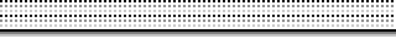

# Gameboy Printer Paper Simulation V1

* Creation Date: 2020-08-23
* Author: *Raphaël BOICHOT*
* Curator: Brian Khuu

Author of this script is *Raphaël BOICHOT* and was posted here with his permission.

Game boy printer emulator with e-paper feature (CrapPrinter)
Code runs very fast with Matlab, slowly with Octave.

This is a companion project with https://github.com/mofosyne/arduino-gameboy-printer-emulator

The purpose of this octave/matlab script is to do an accurate simulation of an
 output of a gameboy printer and the effect of the thermal printer head on the
 gameboy printer roll. This is not the same as a typical receipt printer as you
 will see in the historical writeup below.

## Simulation of the e-paper output:

## Comparison to pixel perfect output:

--------------------------------------------------------------------------------

# Telegram Gameboy Camera Chatroom

Got telegram instant messaging and have some questions or need any advice, or just want to share? Invite link below:

https://t.me/gameboycamera

--------------------------------------------------------------------------------

# Two ways of using the emulator :

- Copy paste game boy serial data obtained from https://github.com/mofosyne/arduino-gameboy-printer-emulator into Entry_file.txt
- Open Octave/Matlab code "Main_Decoder.m"
- Choose some options
- Run and wait
- Enjoy your images

--------------------------------------------------------------------------------

# Octave Screenshots (As of 2020-08-23)

These are the latest as of 2020-08-23 screen shot

--------------------------------------------------------------------------------

# Historical background (As of 2020-08-16)

This conversation occurred in Gameboy Camera Club in discord, contact us for an invite link.

During discussion between *Raphaël BOICHOT* and *maxs - thatguywithagameboycamera*
Raphaël BOICHOT got an idea to simulate the paper output of the gameboy printer.

*herr_zatacke (@herr_gack)* and *Björn (@gameboycameramaniac)* and *crizzlycruz (@23kpixels)* was also in the
chatroom contributing to the discussion of this effort.

> Raphaël BOICHOT
> It gives me an idea : it should be possible to make an "after converter" that outputs images having the same soft aspect that printed paper, I mean the tone, noise, granularity and aliasing due to the printer head. Could somebody send me when possible a very high resolution scan of a printed image from GB camera with a real Game Boy printer, so that I can see what to do ? The idea is to make a real fake printed image.

> R.A.Helllord
> If anyone wants it: https://drive.google.com/file/d/1JRHAElErzPu5oDeHRIkm9hTtXbVukhd9/view?usp=sharing 276MB after compressing it as png, I'll be seeing if I can't get a sharper scan, though

> Raphaël BOICHOT
> It's enough information to try something now, Thanks.

With R.A.Helllord high resolution scan of a real gameboy printer output on good quality paper,
Raphaël BOICHOT obtained a zoomed in sample of the output as ground reference.

He also compared with a typical cash receipt

From here, Raphaël BOICHOT started work on this project. From the sample of a real printer output, he did a simulation of a single speckle.

This allowed him to generate this dot  and then starting with an original perfect rendering of a gameboy printer output... he carefully crappified it to match the original output in reality.

### Original Image

### Attempt 1: First Attempt

### Attempt 2: Less Error

* 

### Attempt 3: Less Pixel Masking

* 

### Attempt 4: Hard To Be Crap Like Reality

> It hard to be crap like reality ~ Raphaël BOICHOT

* 

### Attempt 5: Link

* 

### Attempt 6: Squid

* 

# Gameboy Printer Paper Simulation V2

By Raphaël BOICHOT, 2020-09-10. 
After considering many comparisons between the code V1 and real prints obtained with a recently bought Pocket Printer, I was still not satisfied by the rendering. The difficulty is that the printer add noise to the image at diffrent length scales, what is particularly difficult to render with a fast code. So my new idea was to sample a collection of representative pixels of the different grayscales on a good quality images of isolated pixels printed with my printer.

Typically, there is no image available to print that presents perfectly isolated pixels. My idea was to create a test case with my brand new SD printer :

https://github.com/Raphael-Boichot/The-Arduino-SD-Game-Boy-Printer

So I created this test image :
* 

Then I scanned a print of this image :
* 

And I sampled a collection of 50 pixels of each level of grayscale : 
* 

